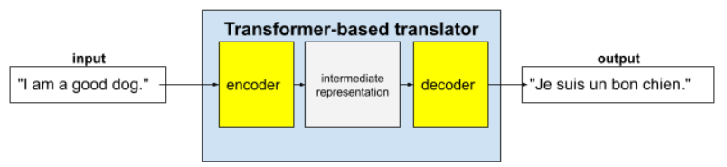
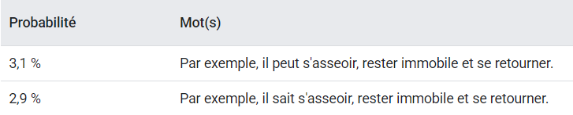

# Module-4-LLM

Une technologie plus récente, les grands modèles de langage (LLM), prédit un jeton ou une séquence de jetons, parfois plusieurs paragraphes de jetons prédits. N'oubliez pas qu'un jeton peut être un mot, un sous-mot (un sous-ensemble d'un mot) ou même un seul caractère. Les LLM génèrent des prédictions bien meilleures que les modèles de langage N-gramme ou les réseaux de neurones récurrents, car:
  - Les LLM contiennent beaucoup plus de paramètres que les modèles récurrents.
  - Les LLM collectent beaucoup plus de contexte.

Cette section présente l'architecture la plus efficace et la plus utilisée pour créer des LLM: le Transformer.

## Transformer

Les Transformer complets se composent d'un encodeur et d'un décodeur:

  - **Encodeur** : Un encodeur convertit le texte d'entrée en représentation intermédiaire. Un encodeur est un réseau de neurones énorme.
  - **Décodeur** : Un décodeur convertit cette représentation intermédiaire en texte utile. Un décodeur est également un réseau de neurones énorme.

Pour chaque jeton d'entrée, l'attention automatique pose la question suivante:  
*"Dans quelle mesure chaque autre jeton d'entrée affecte-t-il l'interprétation de ce jeton ?"*

### Exemple : 
- "The animal didn't cross the street because it was too tired."
- "The animal didn't cross the street because it was too wide."  
Ces deux phrases n'ont pas la même signification.

## Pourquoi les transformateurs sont-ils si grands ?

Les transformateurs contiennent des centaines de milliards, voire des milliers de milliards de paramètres. Ce cours a généralement recommandé de créer des modèles avec un nombre de paramètres inférieur à ceux avec un nombre de paramètres plus élevé. Après tout, un modèle avec un nombre de paramètres inférieur utilise moins de ressources pour effectuer des prédictions qu'un modèle avec un nombre de paramètres plus élevé. Toutefois, les recherches montrent que les Transformers avec plus de paramètres surpassent systématiquement les Transformers avec moins de paramètres.

## Mais comment un LLM génère-t-il du texte ?

En fait, les LLM sont essentiellement des mécanismes de saisie semi-automatique qui peuvent prédire automatiquement des milliers de jetons.

Un LLM suffisamment volumineux peut générer des probabilités pour des paragraphes et des essais entiers.

## Avantages des LLM

Les LLM peuvent :
  - Générer un texte clair et facile à comprendre pour une grande variété d'audiences cibles.
  - Générer des prédictions sur les tâches sur lesquelles ils sont entraînés explicitement.
  - Effectuer des prédictions pour des entrées sur lesquelles ils n'ont pas été explicitement entraînés (en recherche actuellement).

## Problèmes liés aux LLM

L'entraînement d'un LLM implique de nombreux problèmes, dont les suivants:
  - Rassembler un ensemble d'entraînement énorme.
  - Cela prend plusieurs mois et nécessite d'énormes ressources de calcul et d'électricité.
  - Résoudre les défis liés au parallélisme.

L'utilisation de LLM pour déduire des prédictions entraîne les problèmes suivants:
  - Les LLM hallucinent, ce qui signifie que leurs prédictions contiennent souvent des erreurs.
  - Les LLM consomment énormément de ressources de calcul et d'électricité. L'entraînement des LLM sur des ensembles de données plus volumineux réduit généralement la quantité de ressources requises pour l'inférence, bien que les ensembles d'entraînement plus volumineux nécessitent plus de ressources d'entraînement.
  - Comme tous les modèles de ML, les LLM peuvent présenter toutes sortes de biais.

## LLM pré-entraînés 

La transformation d'un LLM de base en une solution répondant aux besoins d'une application nécessite un processus appelé **ajustement**. Un processus secondaire appelé **distillation** génère une version plus petite (moins de paramètres) du modèle affiné.

### Affinage

Les recherches montrent que les capacités de reconnaissance de modèles des modèles de langage de base sont si puissantes qu'elles nécessitent parfois relativement peu d'entraînement supplémentaire pour apprendre des tâches spécifiques. Cet entraînement supplémentaire permet au modèle d'obtenir de meilleures prédictions pour une tâche spécifique. Cet entraînement supplémentaire, appelé ajustement, permet de débloquer le côté pratique d'un LLM.

Le réglage fin s'effectue sur des exemples spécifiques à la tâche que votre application effectuera. Les ingénieurs peuvent parfois affiner un LLM de base sur quelques centaines ou quelques milliers d'exemples d'entraînement.

Malgré le nombre relativement faible d'exemples d'entraînement, l'ajustement fin standard est souvent coûteux en ressources de calcul. En effet, l'ajustement fin standard implique la mise à jour du poids et du biais de chaque paramètre à chaque itération de la backpropagation. Heureusement, un processus plus intelligent appelé **optimisation efficace des paramètres** peut affiner un LLM en ne ajustant qu'un sous-ensemble de paramètres à chaque itération de rétropropagation.

Les prédictions d'un modèle affiné sont généralement meilleures que celles du LLM de fondation. Toutefois, un modèle affiné contient le même nombre de paramètres que le LLM de fondation. Par conséquent, si un LLM de base contient dix milliards de paramètres, la version affinée en contiendra également dix milliards.

### Distillation

La plupart des LLM affinés contiennent un très grand nombre de paramètres. Par conséquent, les LLM de base nécessitent d'énormes ressources de calcul et environnementales pour générer des prédictions. Notez que de grandes parties de ces paramètres sont généralement sans rapport avec une application spécifique.

La distillation crée une version plus petite d'un LLM. Le LLM condensé génère des prédictions beaucoup plus rapidement et nécessite moins de ressources de calcul et environnementales que le LLM complet. Toutefois, les prédictions du modèle distillé ne sont généralement pas aussi bonnes que celles du LLM d'origine. N'oubliez pas que les LLM avec plus de paramètres génèrent presque toujours de meilleures prédictions que les LLM avec moins de paramètres.
